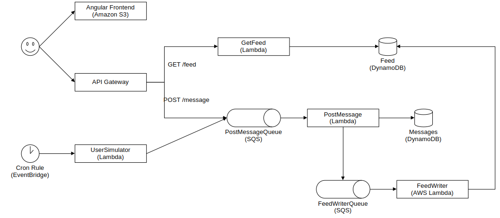

# Kiwi

Kiwi is a **very limited** Twitter-like web app that allows publishing and viewing messages.

## Architecture


## Requirements
- [Node.js](https://nodejs.org)
- [AWS CLI](https://aws.amazon.com/cli/) installed and configured

## Setup
```
npm install
cd frontend
npm install
```

## Deployment
```
# first time only
npx cdk bootstrap

npx cdk deploy KiwiBackendStack --outputs-file backend.json

cd frontend
npm run build
cd ..

npx cdk deploy KiwiFrontendStack
```
